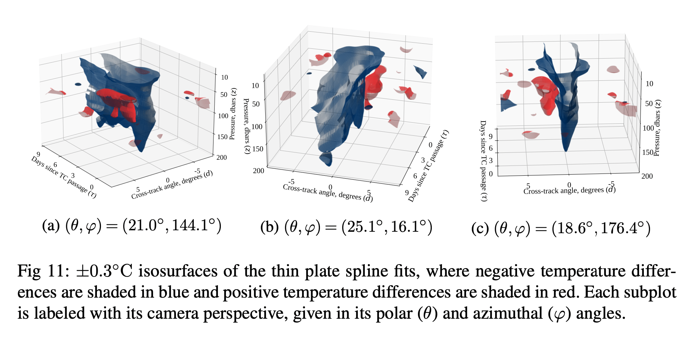

# tc-ocean-methods

Supplementary material for "Spatio-temporal methods for estimating subsurface
ocean thermal response to tropical cyclones."

Manifest:

* `pdf/` contains supplementary pdfs, including `supplement.pdf`, the main 
  supplement.
* `pipeline-gridded/` implements the methodology using temperature profiles 
  gridded at pressure levels 10, 20, ..., 200 dbar.
* `pipeline-integrated/` implements the methodology using the vertically 
  averaged temperature profiles (from 10 dbar to 200 bar).
* `implementations/` provides custom code for thin plate splines.

More information is found in the `README.md` of each directory.

The above figure illustrates the ocean thermal response to tropical cyclone
passage.  The ocean response is characterized by a temperature decrease
along the storm track, which begins in the near surface and continues into
the subsurface, persisting for many days.  A warming effect, induced by
_vertical mixing_, is also observed in the subsurface on the track's right
side.  The asymmetry of the warming effect is attributed to the counterclockwise
wind rotation of tropical cyclones in the Northern Hemisphere.
